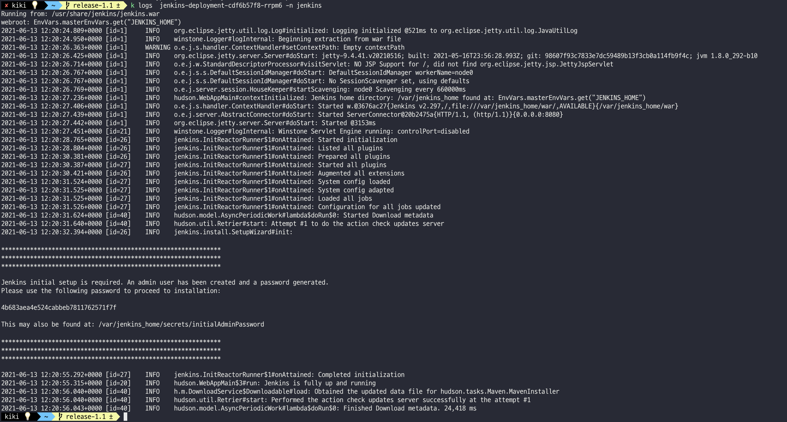
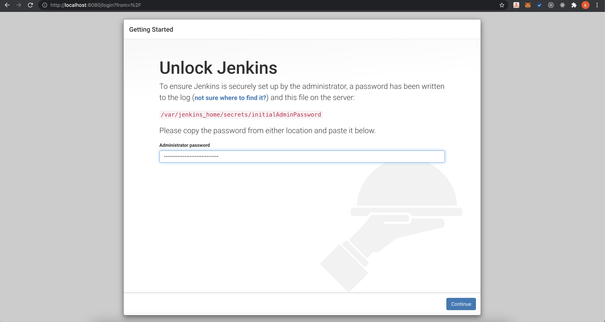
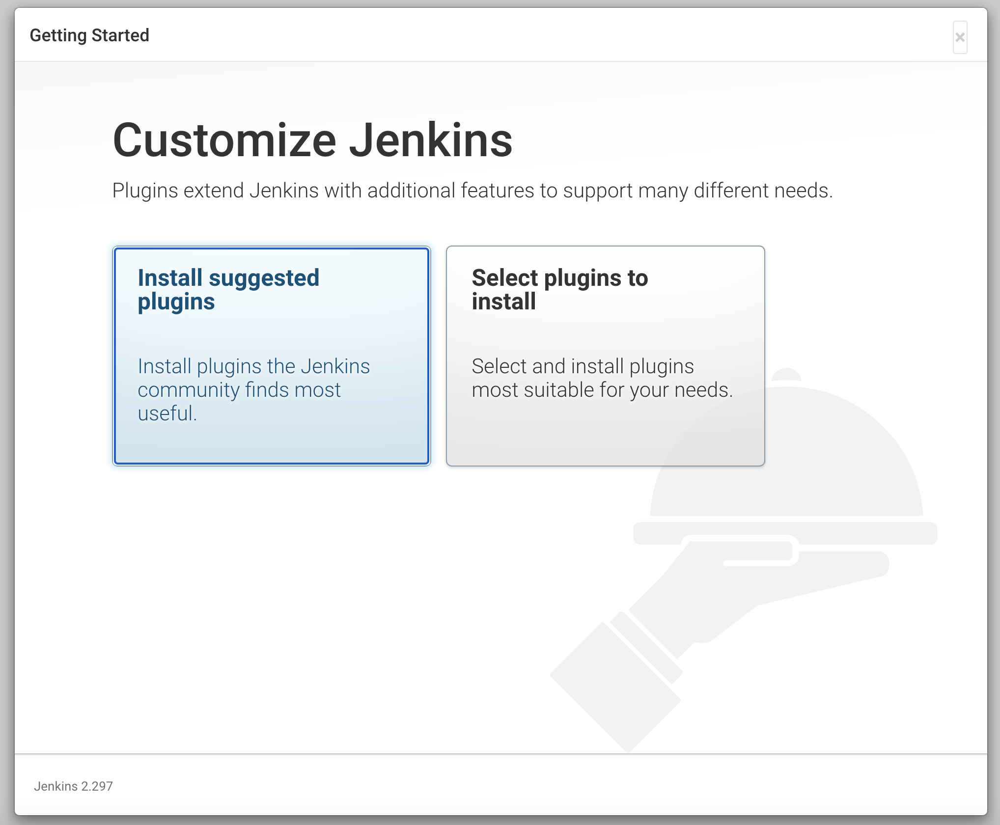

# Jekins

## eks에 jenkins 설치
### Install Jenkins with YAML files
#### Deploy Jenkins
* deployment.yaml 작성
```yaml {.line-numbers}
apiVersion: apps/v1
kind: Deployment
metadata:
  name: jenkins-deployment
spec:
  replicas: 1
  selector:
    matchLabels:
      app: jenkins
  template:
    metadata:
      labels:
        app: jenkins
    spec:
      containers:
      - name: jenkins
        image: jenkins/jenkins:alpine
        ports:
        - containerPort: 8080
        volumeMounts:
        - name: jenkins-home
          mountPath: /var/jenkins_home
      volumes:
        - name: jenkins-home
          emptyDir: {}
```
* create the deployment  
```kubectl create -f jenkins-deployment.yaml -n jenkins```
#### Grant access to Jenkins service
```yaml {.line-numbers}
apiVersion: v1
kind: Service
metadata:
  name: jenkins-service
spec:
  selector:
    app: jenkins
  ports:
    - protocol: TCP
      port: 8081
      targetPort: 8080
  type: LoadBalancer
```
* (참고)[How do I expose the Kubernetes services running on my Amazon EKS cluster?](https://aws.amazon.com/ko/premiumsupport/knowledge-center/eks-kubernetes-services-cluster/)
#### 초기 설정
* 초기 credentials 확인
    * pod name 확인  
    `$ kubectl get pods -n jenkins`
    * log에서 initial password 확인  
    `$ kubectl logs <pod_name> -n jenkins`
    
    * initial password 입력
    
    * 이후 초기 설정 진행
    